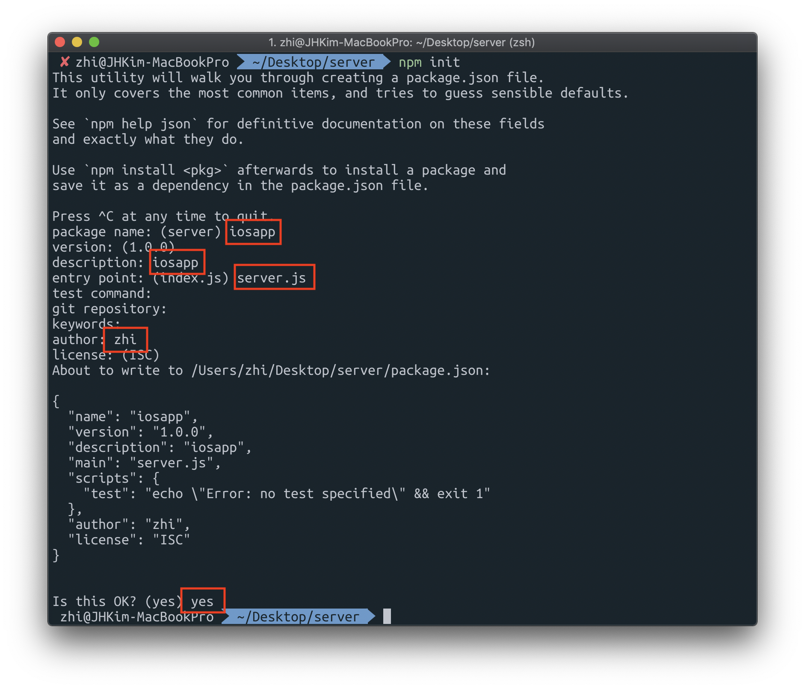
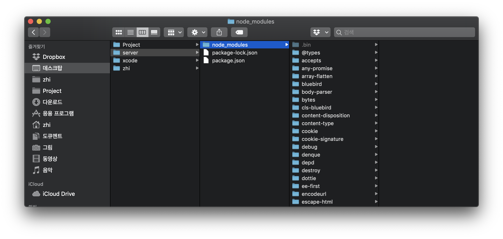
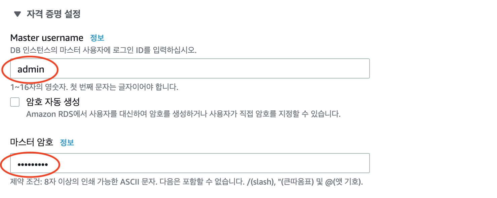
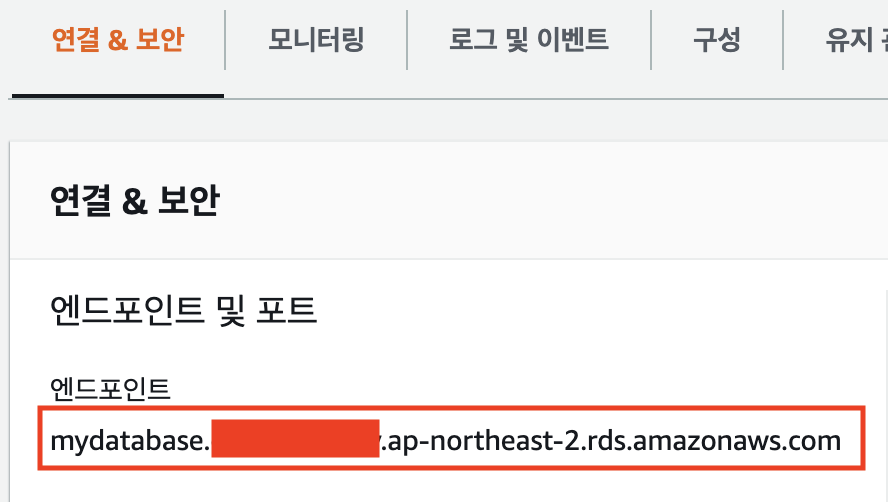
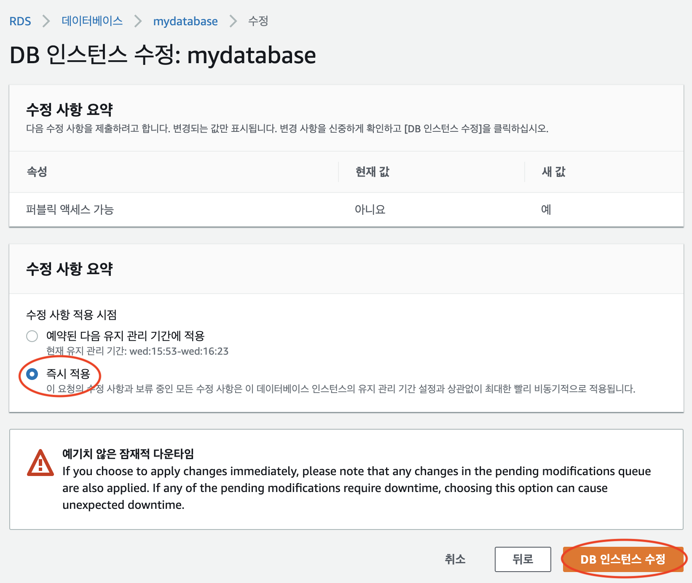
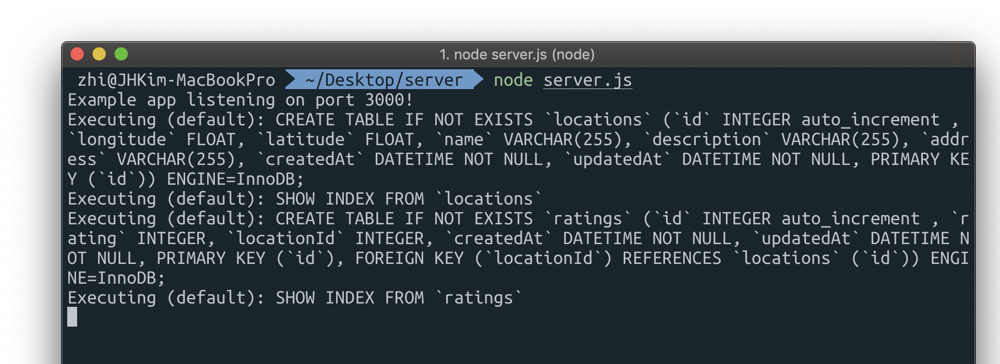

# AUSG-iOS-MapOfRestaurant 🍎

## 1. npm 설치

https://nodejs.org/en/

node.js는 JavaScript 기반으로 구성된 서버 서비스를 JavaScript로 구현할 수 있게 만든 플랫폼입니다. 

npm은 node.js 기반의 모듈을 모아둔 집합 저장소입니다.

node.js 기반으로 서버를 코딩하기 위해 node.js 를 설치해주세요.

npm은 Node Package Manager이기 때문에 node.js를 설치하면 같이 설치됩니다!


설치가 잘 되었는지 혹은 되어있는지 확인하려면 `터미널`을 열어주세요.

```
$ node -v
$ npm -v
```
라고 입력했을 때 버전 정보가 출력된다면 설치가 완료된 상태입니다.


## 2. npm init과 install

설치가 완료 되었다면 서버 코딩을 할 디렉토리를 하나 생성하고,

`npm init`명령어를 입력하여 `package.json`파일을 생성해봅시다.

```
$ mkdir server
$ cd server
$ npm init
```

위 명령어 입력 후 아래 표시된 부분도 입력해주세요.




다음으로는 node.js의 모듈을 받아보겠습니다. 

총 5가지의 모듈의 기능은 다음과 같습니다.


`body-parser` : post로 요청된 body를 쉽게 추출할 수 있는 모듈

`express` : Node.js 웹 애플리케이션 프레임워크

`express-asyncify` :async/await

`mysql2` : RDBMS(Relational Data Base Management System) 오픈소스인 mysql

`sequelize` : ORM(Object Relational Mapping) - application과 Database사이를 맵핑시켜주는 도구


```
$ npm install body-parser express express-asyncify mysql2 sequelize
```


설치가 완료되면 다음과 같이 `node_modules` 디렉토리가 생성되고 `pakage.json` 파일에도 변화가 생기는 것을 볼 수 있습니다.




## 3. model 생성하기

맛집 지도를 만들기 위해
- 장소
- 별점
두 가지의 모델과 appication과 database를 맵핑시켜주는 모델까지
-  sequelize
총 세 가지의 모델을 만들어보겠습니다.

먼저 `models` 디렉토리를 만들어주세요.


### location.js

`location.js` 파일을 만들어 아래 코드를 넣어주세요.

```javascript
const Sequelize = require('sequelize')
const sequelize = require('./sequelize')

class Location extends Sequelize.Model {}
Location.init({
  id: { type: Sequelize.INTEGER, autoIncrement: true, primaryKey: true},
  longitude: Sequelize.FLOAT,
  latitude: Sequelize.FLOAT,
  name: Sequelize.STRING,
  description: Sequelize.STRING,
  address: Sequelize.STRING
}, { sequelize, modelName: 'location' })

module.exports = Location
```


Location에는 위도, 경도, 이름, 상세설명, 주소 정보가 들어갑니다.


### rating.js

`rating.js` 파일을 만들어 아래 코드를 넣어주세요.

```javascript
const Sequelize = require('sequelize')
const sequelize = require('./sequelize')
const Location = require('./location')

class Rating extends Sequelize.Model {}
Rating.init({
  id: { type: Sequelize.INTEGER, autoIncrement: true, primaryKey: true},
  rating: Sequelize.INTEGER,
  locationId: { 
    type: Sequelize.INTEGER,
    
    references: {
      model: Location,
      key: 'id'
    }
  }
}, { sequelize, modelName: 'rating' })

module.exports = Rating
```

Rating에는 별점과 해당 장소가 들어갑니다.


## 4. sequelize.js 작성과 RDS 수정

### sequelize.js

`sequelize.js` 파일을 만들어 아래 코드를 넣어주세요.

```javascript
const Sequelize = require('sequelize')
const sequelize = new Sequelize('[DB 인스턴스 식별자]', '[Master username]', '[마스터 암호]', {
  host: '[엔드포인트 주소]',
  dialect: 'mysql'
})

module.exports = sequelize
```

`Master username`과 `마스터 암호`는 이전 단계에서 꼭 기억하라고 말씀드렸던 그 정보들 입니다. 😉




다른 정보들을 확인하기 위해 AWS Console에 RDS 들어가주세요!

아까 만든 RDS가 잘 생성되어 있는 것을 볼 수 있습니다.


`DB 식별자`는 바로 확인할 수 있습니다. 생성된 데이터베이스를 클릭하여 들어가주세요.

`연결 & 보안` -> `엔드포인트`를 복사해서 넣어주시면 됩니다.





### RDS 수정

생성된 RDS 수정을 클릭해주세요.


`네트워크 및 보안` -> `퍼블릭 액세스 가능성` : 예

로 선택해주세요!


오른쪽 아래 `계속`을 선택해주세요.


`수정 사항 요약`에서 `즉시 적용` 을 선택한 후 `DB 인스턴스 수정`을 클릭해주세요.




## 5. server.js 작성하기

이어서 맛집 지도 만들기를 위한 server.js 를 작성해보겠습니다.

```javascript
const express = require('express')
const asyncify = require('express-asyncify')
const bodyParser = require('body-parser')
const app = asyncify(express())

const Location = require('./models/location')
const Rating = require('./models/rating')

app.use(bodyParser.json()) //middleware

Location.sync({ force: false }).then(function() {
    Rating.sync({ force: false })
})

app.get('/locations', async function (req, res) {
  const locations = await Location.findAll()

  console.log("All location:", JSON.stringify(locations, null, 4));
  res.json(locations)
})

app.post('/locations', async function (req, res) {
  const newLocation = await Location.create({
    longitude: req.body.longitude,
    latitude: req.body.latitude,
    name: req.body.name,
    description: req.body.description,
    address: req.body.address
  })

  console.log("Location created:", JSON.stringify(newLocation, null, 4));
  res.json(newLocation)
})

app.post('/ratings', async function (req, res) {
  const newRating = await Rating.create({
    rating: req.body.rating,
    locationId: req.body.locationId
  })
    
  console.log("Rating created:", JSON.stringify(newRating, null, 4));
  res.json(newRating)
})

app.get('/ratings/:id', async function (req, res) {
    const ratings = await Rating.findAll({
      where: {
        locationId: req.params.id
      }
    })
    let rating = 0

    if (ratings.length != 0) {
      for (let i = 0; i < ratings.length; i++) { 
        rating += ratings[i].dataValues.rating
      }
      console.log(rating)
      rating /= ratings.length
    }
    let result ={
        rating,
    }
      
    console.log("Rating calculated: " + result.rating);
    res.json(result)
})

app.listen(3000, function () {
  console.log('Example app listening on port 3000!');
})
```


기능은 다음과 같습니다.
- 등록된 전체 장소 보기
- 장소 추가하기
- 별점 입력하기 (특정 장소)
- 특정 장소의 별점의 평점 보기


모두 잘 저장되었는지 확인 한번 해주세요! 😉


## 6. 로컬 서버 띄우기

작성한 코드가 올바르게 동작하는지 로컬 서버를 띄워서 확인해보겠습니다.

```
$ node server.js
```




http://localhost:3000/locations

접속해보면 아래와 같이 뜨고 터미널 창에도 로그가 남으면 성공입니다. 🙌


http://localhost:3000/ratings/1

rating도 마찬가지입니다!


---


- [Elastic Beanstalk으로 배포하기](https://github.com/jaehui327/AUSG-iOS-MapOfRestaurant/blob/master/guide/Beanstalk_guide.md)