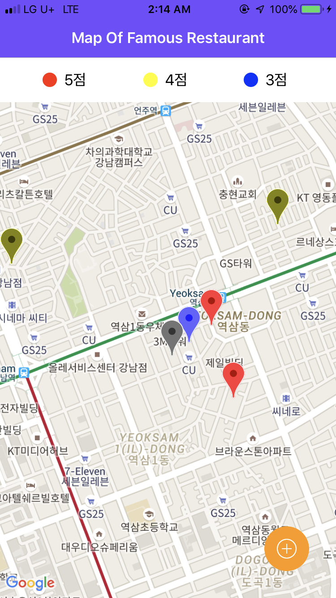
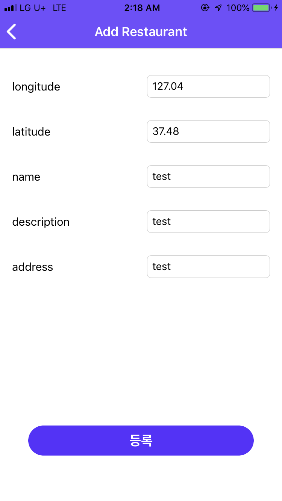
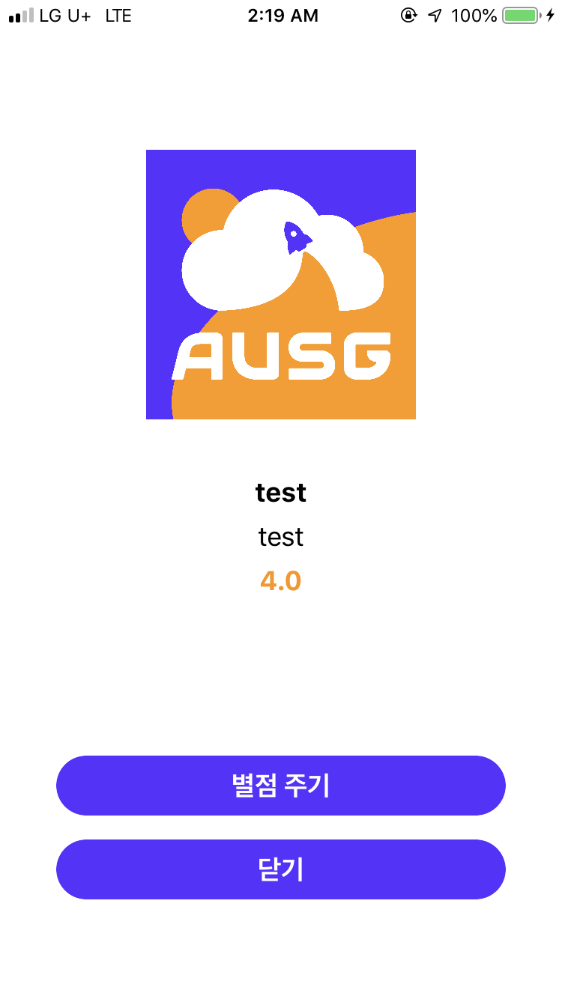
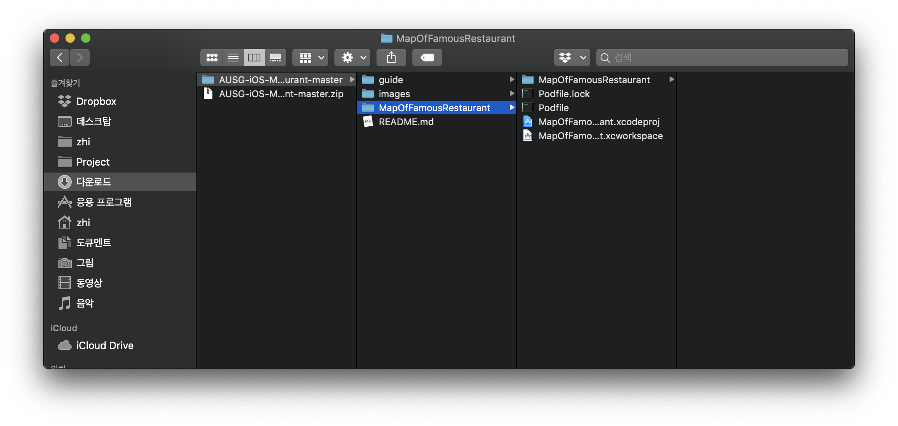
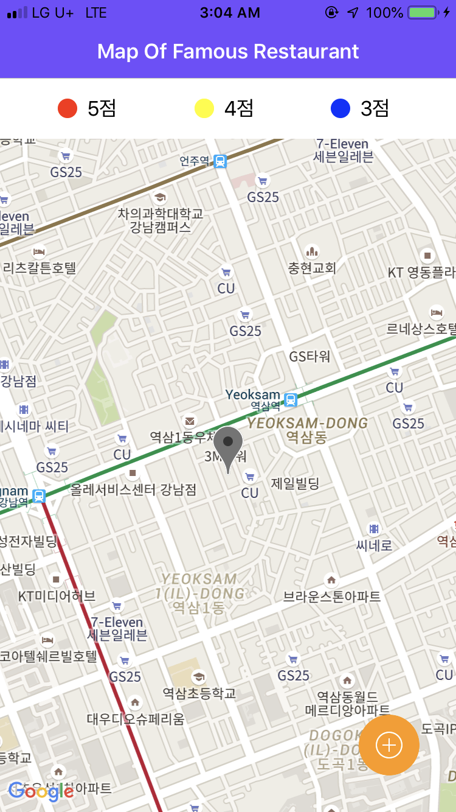
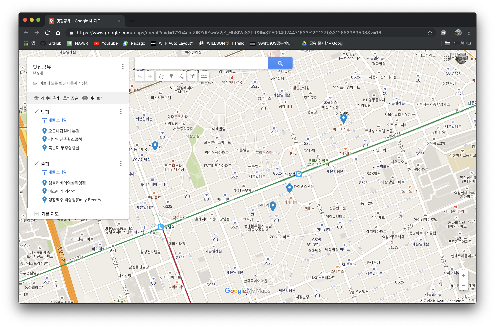

# AUSG-iOS-MapOfRestaurant 🍎

## iOS 서비스에 연결하기

###핸즈온 시간을 고려하여 대부분의 기능이 구현되어 있는 Base 프로젝트를 만들어 두었습니다.
###핸즈온은 이 Base 프로젝트를 수정해 나가는 형식으로 진행됩니다.


### [주요 기능]

#### 별점에 따라 마커의 색상의 변화를 주어 맛집을 구분할 수 있는 맛집 지도입니다. 😆🍴🍔




#### 오른쪽 하단의 `+` 버튼을 누르면 장소를 추가할 수 있습니다.





#### 장소를 추가하면 지도에 위치가 뜹니다. 

#### 마커를 탭하면 나오는 window를 다시 탭하면 상세 정보를 볼 수 있습니다.


#### 아직은 별점 정보가 없는 상태입니다! 넣어볼까요?


#### 별을 탭하여 별점을 선택할 수 있습니다! 4점을 선택해볼게요!


#### 짠! 노란색 마커로 바뀌었습니다. 😎


#### 상세 화면에 별점도 알맞게 변화된 것을 확인할 수 있습니다.




## iOS 프로젝트 파일 받기

https://github.com/jaehui327/AUSG-iOS-MapOfRestaurant

위 링크에 접속하여 `Download ZIP`을 클릭해주세요.


압축을 풀고 프로젝트 폴더를 확인합니다.



`터미널`로 이동하여 `프로젝트 폴더`에서 `pod install` 해줍니다.

```
$ pod install
```


그리고 나서 `workspace` 파일로 열어주세요.


일단 그냥 실행 시켜볼까요?


현재 위치만 찍히는 지도의 모습입니다.




위에서 봤던 모습처럼 수정해봅시다!!

## 프로젝트 파일 수정

### 1. Location.swift
```swift
struct LocationList: Codable {
    /* 추가 부분 시작 */
    struct CustomData: Codable {
        let rating: Double?
    }
    let id: Int
    let longitude: Double?
    let latitude: Double?
    let name: String?
    let description: String?
    let address: String?
    let rating: CustomData?
    /* 추가 부분 끝 */
}
```


### 2. LocationNetworkModel.swift
```swift
import Alamofire

struct LocationService {
    /* 추가 부분 시작 */
    // 주소 등록하기
    // POST /locations
    func postLocationInformation(longitude: Double, latitude: Double, name: String, description: String, address: String, completionHandler: @escaping (LocationList) -> Void) {
        let params = ["longitude" : longitude,
                      "latitude" : latitude,
                      "name" : name,
                      "description" : description,
                      "address" : address] as [String : Any]
        Alamofire.request("\(SERVER_URL)/locations",
            method: .post,
            parameters: params,
            encoding: JSONEncoding.default,
            headers: nil).responseData { dataResponse in
                switch dataResponse.result {
                case .success(let data):
                    do {
                        let locationList = try JSONDecoder().decode(LocationList.self, from: data)
                        completionHandler(locationList)
                    } catch {
                        print("Got and error: \(error)")
                    }
                case .failure(let error):
                    print(error.localizedDescription)
                }
        }
    }
    
    // 모든 주소 가져오기
    // GET /locations
    func getLocationList(completionHandler: @escaping ([LocationList]) -> Void) {
        Alamofire.request("\(SERVER_URL)/locations",
            method: .get,
            parameters: nil,
            headers: nil).responseData{ dataResponse in
                switch dataResponse.result {
                case .success(let data):
                    do {
                        let locationLists = try JSONDecoder().decode([LocationList].self, from: data)
                        completionHandler(locationLists)
                    } catch {
                        print("Got and error: \(error)")
                }
                case .failure(let error):
                    print(error.localizedDescription)
                }
        }
    }
    /* 추가 부분 끝 */
}

```


### 3. RatingNetworkModel.swift

```swift
import Alamofire

struct RatingService {
    /* 추가 부분 시작 */
    // 별점 등록하기
    // POST /rating
    func postRatingInformation(rating: Int, locationId: Int, completionHandler: @escaping (RatingInformation) -> Void) {
        let params = ["rating" : rating,
                      "locationId" : locationId] as [String : Any]
        Alamofire.request("\(SERVER_URL)/ratings",
            method: .post,
            parameters: params,
            encoding: JSONEncoding.default,
            headers: nil).responseData { dataResponse in
                switch dataResponse.result {
                case .success(let data):
                    do {
                        let ratingInformation = try JSONDecoder().decode(RatingInformation.self, from: data)
                        completionHandler(ratingInformation)
                    } catch {
                        print("Got and error: \(error)")
                    }
                case .failure(let error):
                    print(error.localizedDescription)
                }
        }
    }
    /* 추가 부분 끝 */
}
```


### 4. GoogleMapViewController.swift

#### 1) func getLocation()

```swift
func getLocation() {
/* 추가 부분 시작 */
        // 장소 가져오기 - get location list
        locationModel?.getLocationList{ locationLists in
            // self.lactionLists에 대입
            self.locationLists = locationLists
            
            // 응답 log
            print("getLocationList success!")
            
            self.marker.removeAll()
            self.ratingArray.removeAll()
            self.ratingArray.removeAll()
            
            for location in self.locationLists {
                let index = location.id - 1
                self.marker.insert(GMSMarker(), at: index)
                self.marker[index].position = CLLocationCoordinate2D(latitude: location.latitude ?? 0.0, longitude: location.longitude ?? 0.0)
                self.ratingArray.insert(location.rating?.rating ?? 0.0, at: index)
                self.setMakerColor(rating: self.ratingArray[index], index: index)
                self.marker[index].title = location.name
                self.marker[index].snippet = location.description
                self.marker[index].map = self.mapView
                
                self.marker[index].zIndex = Int32(index)
            }
        }
/* 추가 부분 끝 */
    }
```

#### 2)  func mapView(_ mapView: GMSMapView, didTapInfoWindowOf marker: GMSMarker)

```swift
func mapView(_ mapView: GMSMapView, didTapInfoWindowOf marker: GMSMarker) {
        let storyboard = UIStoryboard(name: "Main", bundle: nil)
        guard let viewController: DetailViewController = storyboard.instantiateViewController(withIdentifier: "Detail") as? DetailViewController else { return }
        
        let id = Int(marker.zIndex) + 1
        viewController.locationId = id
        viewController.name = marker.title ?? ""
        viewController.rating = ratingArray[id - 1]
        viewController.address = locationLists[id - 1].address ?? "" /* 주석 해제 */
        
        self.present(viewController, animated: true)
    }
```


### 5. SetStarViewController.swift

```swift
@IBAction func sendRating(_ sender: Any) {
/* 추가 부분 시작 */
        ratingModel?.postRatingInformation(rating: starNum, locationId: locationId) { RatingInformation in
            // 전송 완료 log
            print("postRatingInformation success - locationId: \(self.locationId), starNum: \(self.starNum)")
            self.dismiss(animated: true, completion: nil)
        }
/* 추가 부분 끝 */
    }
```


### 6. AddRestaurantViewController.swift

```swift
@IBAction func tappedSend(_ sender: Any) {
/* 추가 부분 시작 */
        // textfield 값 Double형으로 변환
        guard let longitude = NumberFormatter().number(from: longitudeTextField.text ?? "")?.doubleValue else { return }
        guard let latitude = NumberFormatter().number(from: latitudeTextField.text ?? "")?.doubleValue else { return }
        
        // network
        locaionModel?.postLocationInformation(longitude: longitude, latitude: latitude, name: nameTextField.text ?? "", description: descriptionTextField.text ?? "", address: addressTextField.text ?? "") { locationList in
            // 전송 완료 log
            print("postLocationIformation success - longitude : \(longitude), latitude: \(latitude), name: \(String(describing: self.nameTextField.text)), description: \(String(describing: self.descriptionTextField.text)), address: \(String(describing: self.addressTextField.text))")
            self.navigationController?.popViewController(animated: true)
        }
/* 추가 부분 끝 */
    }
```

### 7. ServerSting.swift

```swift
import Foundation

let SERVER_URL = "[elastic beanstalk url]"

```


## TEST

짠! 완성되었습니다! 👏👏👏


맛집 지도를 만들기 위해 장소 등록이 필요합니다. 

따라서 편하게 입력하실 수 있도록 몇 개의 장소를 제공하려고 합니다.


아래 지도는 AUSG에서 공유하는 맛집 지도입니다. 😊 (몇 군데 없지만.. 본의 아니게 맥주집 위주.. ㅎㅎㅎ)





이 지도에 있는 장소에 대한 정보는 다음과 같습니다.


- 텀블러비어 역삼직영점
  - longtitude : 127.03474
  - latitude : 37.4987
  - name : tumbler beer
  - description : beer
  - address : Gangnam-gu, Seoul


- 바스버거 역삼점
  - longtitude : 127.03582
  - latitude : 37.49962
  - name : basburger
  - description : burger
  - address : Gangnam-gu, Seoul


- 생활맥주 역삼점
  - longtitude : 127.03929
  - latitude : 37.50318
  - name : dailybeer
  - description : beer
  - address : Gangnam-gu, Seoul


- 신촌황소곱창 강남역
  - longtitude : 127.02715
  - latitude : 37.50181
  - name : kshgop
  - description : gopchang
  - address : Gangnam-gu, Seoul


이 정보 외에도 
  - longtitude : 127.02 ~ 06
  - latitude : 37.47 ~ 51

사이 값으로 장소를 넣어 주시면 현재 위치 근방으로 설정 가능합니다. ☺️


## 모두 수고하셨습니다. 앞으로도 재밌는 개발되세요! 🙏😉

---

- [삭제 가이드](https://github.com/jaehui327/AUSG-iOS-MapOfRestaurant/blob/master/guide/delete_guide.md)